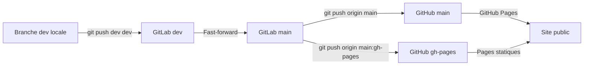

# Developpement et mise en production

Ce document complete le README en detaillant comment publier la branche `main` sur GitHub a partir de l'environnement GitLab.

## Prerequis
- depot clone avec les deux remotes configurees :
  - `origin` vers GitHub (`git@github.com:Guiraud/bingo-mascu.placedelinfo.org.git`)
  - `dev` vers GitLab (`git@gitlab.com:Guiraud/bingo-mascu-placedelinfo-org.git`)
- arborescence propre (`git status` sans modifications locales restantes)
- CI GitLab verte et verification manuelle de la branche `dev`

## Procedure pas a pas
1. **Mettre a jour la branche de travail**
   ```bash
   git checkout dev
   git pull --ff-only dev dev
   python3 -m py_compile server.py
   ```
   Poussez ensuite sur GitLab pour declencher le site de preproduction :
   ```bash
   git push dev dev
   ```
2. **Verifier le rendu de preproduction** sur `https://bingo-mascu.mehdiguiraud.net` (ou l'URL de staging active) et valider que la base de donnees et les pages HTML fonctionnent comme prevu.
3. **Propager vers la production GitLab**
   ```bash
   git checkout main
   git fetch dev main
   git merge --ff-only dev/main
   git push dev main
   ```
   Cette serie de commandes fast-forwarde `main` sur GitLab sans creer de commit de fusion.
4. **Publier sur GitHub Pages**
   ```bash
   git push origin main
   git push origin main:gh-pages
   ```
   GitHub met a jour la page publique aussitot que la branche `main` (et `gh-pages` si configuree) est forcee a l'etat de GitLab.

## Chronologie des branches


## Rappels
- Utilisez `--ff-only` pour eviter tout commit de merge inattendu entre `dev` et `main`.
- Si `git merge --ff-only dev/main` echoue, rebasez ou nettoyez la branche `dev` avant de recommencer.
- Pensez a purger les caches Cloudflare ou GitHub Pages si la mise a jour ne se propage pas immediatement.
