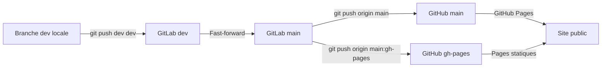

# Developpement et mise en production

Ce document complète le README en détaillant le flux pour publier la branche `main`/`gh-pages` sur GitHub à partir de l’environnement GitLab.

## Prérequis
- dépôt cloné avec les remotes configurés :
  - `origin` → `git@github.com:Guiraud/bingo-mascu.placedelinfo.org.git`
  - `dev` → `git@gitlab.com:Guiraud/bingo-mascu-placedelinfo-org.git`
- arbre propre (`git status` ne doit pas lister de modifications locales).
- pipeline GitLab CI vert sur `dev`.
- vérification manuelle récente de la préproduction (`https://guiraud.gitlab.io/bingo-mascu.placedelinfo.org/`) et du Worker `https://workers-argumentaires-dev.mehdi-guiraud.workers.dev`.

## Procédure pas à pas
1. **Mettre à jour et tester la branche de travail**
   ```bash
   git checkout dev
   git pull --ff-only dev dev
   python3 -m py_compile server.py
   python3 ci_test_api.py
   ```
   Déployez ensuite la préproduction :
   ```bash
   git push dev dev
   ```
2. **Contrôler la préproduction**
   - Visiter le site GitLab Pages et vérifier la génération de la grille, l’export PDF et le formulaire `bdd.html`.
   - Tester l’API : `curl https://workers-argumentaires-dev.mehdi-guiraud.workers.dev/api/argumentaires`.
3. **Fast-forwarder la production côté GitLab**
   ```bash
   git checkout main
   git fetch dev main
   git merge --ff-only dev/main
   git push dev main
   ```
4. **Publier sur GitHub / Cloudflare**
   ```bash
   git push origin main
   git push origin main:gh-pages
   ```
5. **Mettre à jour le Worker si nécessaire**
   - Secrets / déploiement :
     ```bash
     TURNSTILE_SITE_KEY="pk_live_…" \
     TURNSTILE_SECRET_VALUE="sk_live_…" \
     API_SHARED_SECRET_VALUE="…" \
     ./scripts/deploy.sh both
     ```
   - Vérifier ensuite `https://bingo-mascu.mehdiguiraud.net/bdd.html` et une soumission d’argumentaire.

## Chronologie des branches


## Rappels
- Toujours utiliser `--ff-only` pour éviter les merges accidentels.
- Si le fast-forward échoue, rebasez ou nettoyez `dev` puis recommencez.
- Pensez à purger le cache Cloudflare et à régénérer les secrets si un nouvel environnement est ajouté (mettre à jour `_headers` + `STATIC_ALLOWED_ORIGINS`).
- `ci_test_api.py` nettoie la base après test ; exécutez-le avant chaque publication pour garantir l’écriture SQLite.
